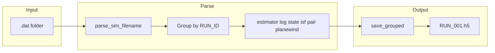

# Simulation HDF5 Converter

A Python pipeline for converting simulation `.dat` exports into grouped HDF5 archives. Built during a research internship focused on quantum computing workloads and high-performance computing data workflows.

## 📋 Overview

This tool reads simulation `.dat` files (estimator, log, state, and related measurement types), groups them by `RUN_ID`, and writes one structured HDF5 file per run. It supports batch conversion, HDF5-to-`.dat` export, round-trip verification, and optional gzip compression.

## 💡 Motivation

Large-scale simulation campaigns produce many small text files that are slow to parse and difficult to organize at scale. HDF5 provides a portable binary format with attached metadata, which makes it easier to:

- Reduce I/O overhead during analysis
- Store row and column context alongside numeric arrays
- Share reproducible datasets between pipeline stages

This project packages that conversion step into a small, scriptable CLI that can be run locally or inside batch jobs.

## 🛠️ Tech Stack

| Layer | Technology |
|---|---|
| Language | Python 3.11+ |
| Numerics | NumPy |
| HDF5 I/O | h5py |

## ✨ Features

- Batch `.dat` folder to HDF5 (one `.h5` per `RUN_ID`)
- Interactive and CLI modes for convert, export, and round-trip
- Optional gzip compression with shuffle filter
- Dataset metadata for column names and source file provenance
- Synthetic sample dataset for quick testing
- Safe publish workflow documented in `docs/PUBLISH.md`

## 📁 Project Structure

```
gce-hdf5-converter/
├── convert_batch.py          # Batch .dat -> HDF5 CLI
├── interconvert.py           # dat-to-h5, h5-to-dat, roundtrip
├── validate_output.py        # Verify grouped HDF5 output
├── text_io.py                # .dat parsing and batch conversion
├── hdf5_io.py                # HDF5 read/write helpers
├── export_io.py              # HDF5 -> .dat export and round-trip compare
├── cli_prompts.py            # Interactive prompts
├── requirements.txt
├── docs/
│   └── PUBLISH.md            # Safe sync checklist from private dev repo
├── examples/
│   └── sample_dat/           # Synthetic demo .dat files (RUN_001)
└── README.md
```

## 📦 Installation

```bash
git clone https://github.com/arnoldfolarin/hdf5-conversion-script.git
cd hdf5-conversion-script
python -m venv .venv
```

Windows:

```powershell
.\.venv\Scripts\Activate.ps1
pip install -r requirements.txt
```

macOS / Linux:

```bash
source .venv/bin/activate
pip install -r requirements.txt
```

## 🚀 Usage

Convert the included sample folder:

```bash
python convert_batch.py examples/sample_dat output/ --batch-only --no-compression
```

Verify the generated HDF5:

```bash
python validate_output.py output/RUN_001.h5
```

Convert with the interconvert CLI:

```bash
python interconvert.py dat-to-h5 examples/sample_dat output/ --no-compression
```

Export HDF5 back to `.dat` files:

```bash
python interconvert.py h5-to-dat output/RUN_001.h5 exported_dat/
```

Round-trip test (convert, export, compare):

```bash
python interconvert.py roundtrip examples/sample_dat --work-dir roundtrip_work --no-compression
```

Run interactively (no arguments):

```bash
python convert_batch.py
python interconvert.py
```

### ⌨️ CLI options

**`convert_batch.py`**

| Argument / flag | Description |
|---|---|
| `input` | Folder with `.dat` files |
| `output` | Output folder for `.h5` files |
| `--batch-only` | Skip direction menu; convert immediately |
| `--compression` | `gzip-1`, `gzip`, or `gzip-9` |
| `--no-compression` | Disable compression |

**`interconvert.py` subcommands**

| Subcommand | Description |
|---|---|
| `dat-to-h5` | Convert `.dat` folder to HDF5 |
| `h5-to-dat` | Export one `.h5` file to `.dat` files |
| `roundtrip` | Convert, export, and compare byte-for-byte |

## 📊 Sample Input Format

Simulation files use the naming pattern:

```
sim-<type>-<T>-<L>-<u>-<t>-<RUN_ID>.dat
```

Numeric files include a header comment and column labels:

```
# RUN_ID: RUN_001
#               K               V           V_ext           V_int               E
 2.99237404E+02 -4.17045815E+02  0.00000000E+00 -4.14177231E+02 -1.17808411E+02
```

## 🏗️ Architecture



## 🔮 Future Improvements

- YAML configuration for compression defaults
- Parquet export for analytics pipelines
- Automated pytest coverage for validation edge cases
- Nested multi-run HDF5 layout for combined archives

## 📄 License

This project is released for portfolio and educational purposes. You may view, reference, and learn from the code, but please do not redistribute it as your own work without attribution.
