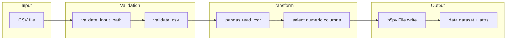

# GCE HDF5 Converter

A lightweight Python pipeline for converting tabular scientific simulation exports into HDF5 archives. Built during a research internship focused on quantum computing workloads and high-performance computing data workflows.

## 📋 Overview

GCE HDF5 Converter reads CSV files containing simulation observables and writes structured HDF5 output suitable for downstream analysis on workstations or supercomputer filesystems. The tool validates input schema, preserves column metadata, and supports optional gzip compression for efficient storage.

## 💡 Motivation

Large-scale simulation campaigns produce many small text files that are slow to parse and difficult to organize at scale. HDF5 provides a portable binary format with attached metadata, which makes it easier to:

- Reduce I/O overhead during analysis
- Store row and column context alongside numeric arrays
- Share reproducible datasets between pipeline stages

This project packages that conversion step into a small, scriptable CLI that can be run locally or inside batch jobs.

## 🛠️ Tech Stack

| Layer | Technology |
|---|---|
| Language | Python 3.11+ |
| Tabular I/O | Pandas |
| Numerics | NumPy |
| HDF5 I/O | h5py |

## ✨ Features

- Command-line CSV to HDF5 conversion
- Input validation for missing files, empty tables, and duplicate columns
- Optional gzip compression with shuffle filter
- Dataset metadata for column names and source file provenance
- Structured logging with verbose mode
- Synthetic sample dataset for quick testing

## 📁 Project Structure

```
gce-hdf5-converter/
├── converter.py              # CLI entry point
├── utils.py                  # Validation and logging helpers
├── requirements.txt          # Python dependencies
├── .gitignore
├── examples/
│   └── sample_input.csv      # Synthetic demo input
└── README.md
```

## 📦 Installation

```bash
git clone https://github.com/arnoldfolarin/hdf5-conversion-script.git
cd hdf5-conversion-script
python -m venv .venv
```

Windows:

```powershell
.\.venv\Scripts\Activate.ps1
pip install -r requirements.txt
```

macOS / Linux:

```bash
source .venv/bin/activate
pip install -r requirements.txt
```

## 🚀 Usage

Convert the included sample file:

```bash
python converter.py examples/sample_input.csv -o output/results.h5
```

With verbose logging and no compression:

```bash
python converter.py examples/sample_input.csv -o output/results.h5 --compression none -v
```

Custom dataset name:

```bash
python converter.py examples/sample_input.csv -o output/results.h5 --dataset-name observables
```

### ⌨️ CLI options

| Flag | Description |
|---|---|
| `input` | Path to input CSV file |
| `-o`, `--output` | Path to output HDF5 file |
| `--compression` | `gzip` (default) or `none` |
| `--dataset-name` | HDF5 dataset label (default: `data`) |
| `-v`, `--verbose` | Enable debug logging |

## 📊 Sample Output

Example log output:

```
2026-06-25 10:15:02 [INFO] Reading CSV: examples/sample_input.csv
2026-06-25 10:15:02 [INFO] Wrote HDF5 file: output/results.h5
2026-06-25 10:15:02 [INFO] Compression: gzip
```

Example HDF5 layout:

```
results.h5
├── attrs
│   ├── source_file: sample_input.csv
│   ├── row_count: 10
│   ├── column_count: 4
│   └── converter_version: 1.0.0
└── data                      # shape (10, 4), float64
    └── attrs
        ├── columns: [timestep, energy, magnetization, acceptance_rate]
        └── source_columns: [run_id, timestep, energy, magnetization, acceptance_rate]
```

Non-numeric columns such as `run_id` are preserved in metadata but excluded from the numeric dataset array.

## 🏗️ Architecture



## 🔮 Future Improvements

- Batch conversion for folders of CSV files
- YAML configuration for column mappings and compression defaults
- Parquet export for analytics pipelines
- Automated pytest coverage for validation edge cases
- Optional round-trip export back to CSV for verification

## 📄 License

This project is released for portfolio and educational purposes. You may view, reference, and learn from the code, but please do not redistribute it as your own work without attribution.
